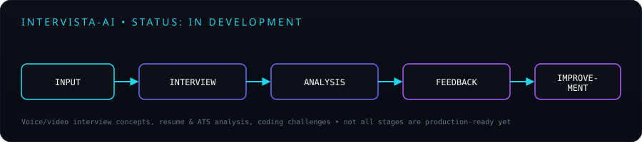
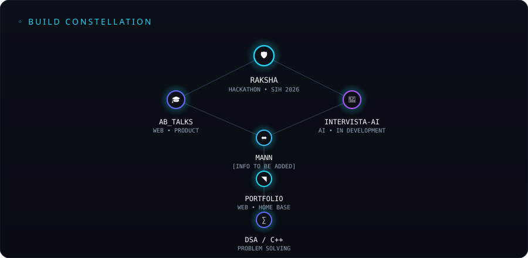
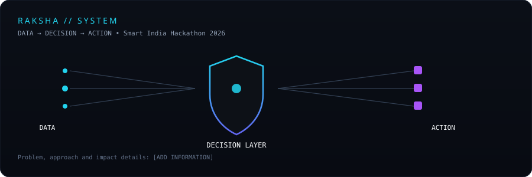
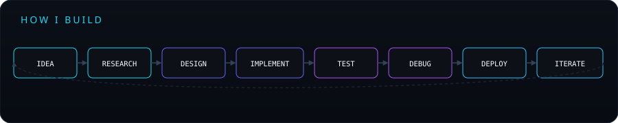
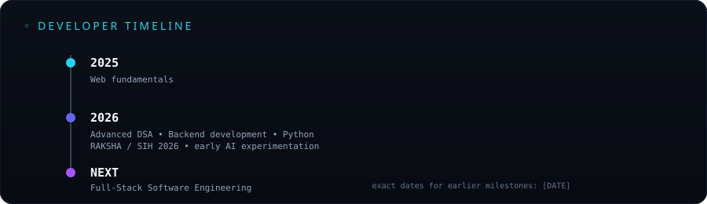
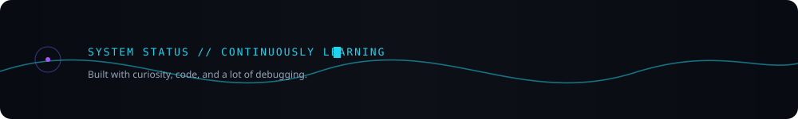

<!-- =========================================================
     01 — HERO
     ========================================================= -->
<div align="center">

<picture>
  <source media="(prefers-color-scheme: dark)" srcset="./assets/hero-dark.svg">
  
</picture>

<br/>

[](https://git.io/typing-svg)

</div>

<!-- =========================================================
     02 — NAVIGATION
     ========================================================= -->
<div align="center">

[`ABOUT`](#about) &nbsp;&#183;&nbsp;
[`STACK`](#technology-matrix) &nbsp;&#183;&nbsp;
[`PROJECTS`](#selected-builds) &nbsp;&#183;&nbsp;
[`DSA`](#problem-solving-labs) &nbsp;&#183;&nbsp;
[`PYTHON / AI`](#python--ai) &nbsp;&#183;&nbsp;
[`ACTIVITY`](#contribution-telemetry) &nbsp;&#183;&nbsp;
[`CONTACT`](#contact)

</div>

<br/>

<!-- =========================================================
     03 — ENGINEER PROFILE
     ========================================================= -->
### 🔹ABOUT 

```bash
┌─ ~/manu/profile ───────────────────────────────────┐
│                                                     │
│ $ whoami                                            │
│ Manu Kumar                                          │
│                                                      │
│ $ current_role                                      │
│ CSE Student / Full-Stack Developer in progress       │
│                                                      │
│ $ primary_focus                                     │
│ Full-Stack Development                              │
│ C++ / Advanced DSA                                  │
│ Python / AI Exploration                             │
│                                                      │
│ $ philosophy                                        │
│ Learn → Build → Break → Understand → Improve         │
│                                                      │
└──────────────────────────────────────────────────────┘
```

I'm a Computer Science student building toward full-stack software engineering — comfortable across frontend and backend, working through advanced Data Structures & Algorithms in C++ to sharpen problem-solving, and using Python to explore automation and early AI/data work. I'd rather ship a small real project than finish another tutorial — RAKSHA, built for Smart India Hackathon 2026, is the clearest example of that so far.

<br/>


<!-- =========================================================
     05 — TECHNOLOGY MATRIX
     ========================================================= -->
### 🔸TECHNOLOGY MATRIX

<table>
<tr><td valign="top" width="50%">

**01 — CORE LANGUAGES**


**02 — FRONTEND**

 &nbsp; responsive UI &#183; component architecture

</td><td valign="top" width="50%">

**03 — BACKEND**

 &nbsp; REST APIs &#183; database development

**04 — PYTHON**

Python libraries &#183; automation &#183; data experimentation &#183; AI experimentation

</td></tr>
<tr><td colspan="2">

**05 — ENGINEERING TOOLS**


</td></tr>
</table>

<sub>Icons via <a href="https://skillicons.dev">skillicons.dev</a></sub>

<br/>

<!-- =========================================================
     06 — TECH CONSTELLATION
     ========================================================= -->

<!-- =========================================================
     07 — CURRENT DEVELOPMENT STATUS
     ========================================================= -->
### 🔸CURRENT DEVELOPMENT STATUS

```
╭──────────────────────────────────────────────╮
│           CURRENT DEVELOPMENT STATUS          │
├──────────────────────────────────────────────┤
│                                                │
│ ⚙ BUILDING                                    │
│   Full-stack web applications                 │
│   Real-world product experiences               │
│                                                │
│ 🧠 IMPROVING                                   │
│   Advanced DSA · C++ · Backend Architecture     │
│                                                │
│ 🐍 EXPLORING                                   │
│   Python ecosystem · Python libraries           │
│                                                │
│ ◉ RESEARCHING                                  │
│   AI-driven software                           │
│                                                │
╰──────────────────────────────────────────────╯
```

<br/>

<!-- =========================================================
     08 — SELECTED BUILDS
     ========================================================= -->
### 🔸SELECTED BUILDS

Projects are where I turn concepts into software.

<table>
<tr><td width="50%" valign="top">

#### 🛡️ RAKSHA — `SIH 2026`
**DATA → DECISION → ACTION**

*"Bridging the Gap between Data and Action."* A Smart India Hackathon 2026 submission — problem-first, built end-to-end for the hackathon rather than as a tutorial exercise.

`Problem:` Fragmented disaster data slows emergency response.
`Approach:` Turn satellite data into prioritized rescue actions.
`Technology:` React · TypeScript · Node.js · PostgreSQL · PostGIS · Leaflet
`Status:` Hackathon build

[`Repository`](https://github.com/manukumsr54/SIH_2026_Project) &#183; `Demo Link: https://github.com/manukumsr54/SIH_2026_Project`

</td><td width="50%" valign="top">

#### 🎓 AB_TALKS — Student Hub
**CAMPUS FEED · OPPORTUNITIES · DEADLINES · SAVED ITEMS · SEARCH**

A student intelligence hub built for the AB Talks Hackathon — one place for announcements, opportunities, deadlines, events, internships and scholarships instead of five scattered ones.

`Tech stack:` React · Vite · Tailwind CSS · JavaScript · Lucide React
`My role:` Frontend and Integration & Development
`Status:` Hackathon build

[`Repository`](https://github.com/manukumsr54/AB_Talks) &#183; `Live Demo: ab-talks-lilac.vercel.app`

</td></tr>
<tr><td width="50%" valign="top">

#### 🎤 INTERVISTA-AI
**AI INTERVIEW COACH**

A startup-style AI interview preparation platform — mock interviews, performance analysis, resume/ATS analysis, coding challenges, behind a SaaS-style frontend and backend.

`Tech stack:` React · JavaScript · Node.js · Express · MongoDB · Tailwind
`Status:` Public



`Repository: https://github.com/zaid786-collab/Intervista-AI` &#183; `Live Demo: [ADD LINK]`

</td><td width="50%" valign="top">

#### ⌬ MANN
[PROJECT INFORMATION TO BE ADDED]

`Tech stack:` [ADD INFORMATION]
`Problem it solves:` [ADD INFORMATION]

`Repository: [ADD LINK]`

<sub>Placeholder kept intentionally polished and easy to replace once MANN's scope is finalized . </sub>

</td></tr>
<tr><td width="50%" valign="top">

#### ◩ PORTFOLIO
**MANU // PORTFOLIO**

My personal developer showcase and the home base for my online developer identity — frontend development, UI/UX, responsive interfaces, and write-ups of the projects above.

`Tech stack:` Next.js · React · TypeScript · Once UI · CSS Modules · MDX · Vercel

`Repository: [ADD LINK]` &#183; `Live Site: [ADD LINK]`

</td><td width="50%" valign="top">

#### ∑ DSA // C++
**PROBLEM-SOLVING LABORATORY**

Arrays &#183; Linked Lists &#183; Stacks &#183; Queues &#183; Trees &#183; Graphs &#183; Hashing &#183; Algorithms &#183; Complexity Analysis

An ongoing, running log — not a finished body of work.

`Repository: [ADD LINK to DSA repo]`

</td></tr>
</table>

<br/>

<!-- =========================================================
     09 — PROJECT CONSTELLATION
     ========================================================= -->
### 🔸PROJECT CONSTELLATION

<div align="center">

</div>

<details>
<summary><b>RAKSHA — system detail</b></summary>
<br/>

</details>

<br/>

<!-- =========================================================
     10 — PROBLEM SOLVING LAB
     ========================================================= -->
### 🔸PROBLEM SOLVING LABS

```
C++
 │
 ├── Data Structures
 ├── Algorithms
 ├── Complexity Analysis
 ├── Optimization
 └── Problem Solving
```

Actively working through advanced Data Structures & Algorithms in C++, with a focus on writing correct, efficient solutions and reasoning about time/space complexity — not just getting a green checkmark.

<div align="center">

<!-- Optional: if you solve on LeetCode/Codeforces/GFG, a static badge is more reliable
     than a scraped stats card. Replace [ADD HANDLE] once you have one, or delete these lines. -->


</div>

<br/>

<!-- =========================================================
     11 — PYTHON → AI
     ========================================================= -->
### 📝PYTHON → AI

**PYTHON → EXPERIMENTATION → INTELLIGENCE**

```
🐍 PYTHON
      ↓
  LIBRARIES
      ↓
 EXPERIMENTS
      ↓
  PROJECTS
      ↓
AI APPLICATIONS
```

I'm not claiming AI expertise — I'm using Python as the entry point into it: learning the libraries, building small projects, and using that to explore automation and early data-driven features inside larger apps like RAKSHA and Intervista-AI.

<br/>

<!-- =========================================================
     12 — HOW I BUILD
     ========================================================= -->
### 🔸HOW I BUILD

<div align="center">

</div>

<br/>

<!-- =========================================================
     13 — DEVELOPER TIMELINE
     ========================================================= -->
### 🔸DEVELOPER TIMELINE

<div align="center">

</div>

<br/>

<!-- =========================================================
     14 — BUILD QUEUE
     ========================================================= -->
### 🔸BUILD QUEUE
<sub>Current focus / learning momentum — not a proficiency score.</sub>

```
[■■■■■■■■■■] Full-Stack Development     current focus
[■■■■■■■□□□] Advanced DSA               active practice
[■■■■■■□□□□] Python                     ongoing
[■■■■■□□□□□] AI                         exploring
[■■■■□□□□□□] Open Source                early stage
```

<br/>

<!-- =========================================================
     15 — CONTRIBUTION TELEMETRY
     ========================================================= -->
### 🔸CONTRIBUTION TELEMETRY

<div align="center">

<picture>
  <source media="(prefers-color-scheme: dark)" srcset="https://raw.githubusercontent.com/manukumsr54/manukumsr54/output/github-snake-dark.svg">
  
</picture>

<br/><br/>


<br/>


</div>

> Every card here is generated live from public activity — nothing is hand-typed. The snake animation and stats cards each have a self-hosted fallback (see the Implementation Guide) if the shared instances are ever slow or rate-limited.

<br/>

<!-- =========================================================
     16 — ENGINEERING PHILOSOPHY
     ========================================================= -->
### 🔸ENGINEERING PHILOSOPHY

```
BUILD.
BREAK.
UNDERSTAND.
IMPROVE.
SHIP.
```

Learning becomes valuable when it turns into something usable.

<br/>

<!-- =========================================================
     17 — CONTACT
     ========================================================= -->
### 🔸CONTACT

<div align="center">

Let's build something meaningful.

<a href="https://github.com/manukumsr54"></a>
<a href="https://www.linkedin.com/feed/"></a>
<a href="[ADD PORTFOLIO URL]"></a>
<a href="mailto:manukumsr54@gmail.com"></a>
<a href="[ADD RESUME URL]"></a>

</div>

<br/>

<!-- =========================================================
     18 — ANIMATED FOOTER
     ========================================================= -->
<div align="center">

</div>